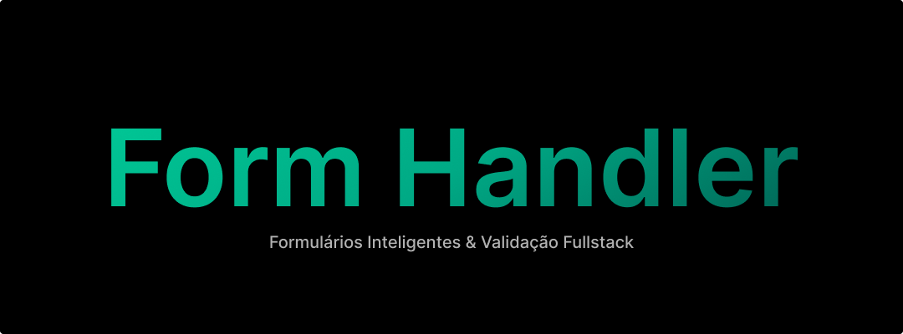

# 🧪 Form Handler

Form Handler é um projeto fullstack de estudo que explora o fluxo completo de um formulário web — desde a validação no frontend até o armazenamento dos dados no backend. Ele foi pensado para praticar integração entre camadas, feedbacks ao usuário e uso de boas práticas com validação em ambos os lados da aplicação.

### 📌 Objetivo

O projeto tem como foco a criação de um formulário dinâmico com validação robusta e integração com uma API backend. O sistema garante que os dados sejam validados corretamente no frontend e backend, retornando mensagens apropriadas ao usuário.

### 🧱 Tecnologias Utilizadas

#### Frontend

- **React** com **TypeScript**
- **React Hook Form** para controle do formulário
- **Zod** para validação dos dados
- **CSS:** para dar os estilos

#### Backend

- **Node.js** com **TypeScript**
- **Express** para API REST
- **Zod** para validação
- **Prisma ORM** para acesso ao banco
- **SQLite** como banco de dados

### 📝 Funcionalidades

- Formulário dinâmico com validações
- Exibir/ocultar senha
- Máscaras para CPF, telefone e CEP
- Busca automática de endereço via API de CEP
- Feedback de erro e sucesso
- Persistência dos dados em banco de dados

#### 👀 Por que esse projeto se destaca?

- User-friendly: Feedback claro de erros e UX otimizado
- Robusto: Validação em dupla camada (front + back) para evitar dados inválidos
- Pronto para produção: Estrutura escalável e código tipado

### 🔧 Como Rodar o Projeto

```bash
# Clone o repositório
git clone https://github.com/paulopbi/form-handler
cd form-handler

# Instalando as dependências no frontend
cd client
npm install

# Instalando as dependências no backend
cd server
npm install

# Rode o frontend
cd client
npm run dev

# Rode o backend
cd server
npm run dev
```

### 📜 Licenca

Este projeto utiliza a licença [MIT](./license).
